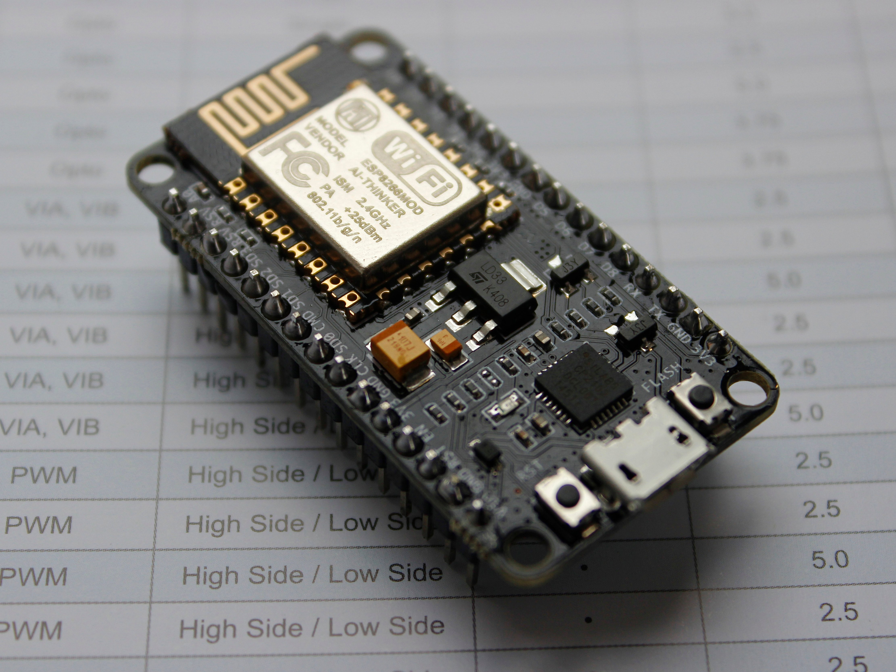

# ESP8266 Captive Portal for rickrolling

This turns an ESP8266 into an Access Point (WiFi-Hotspot) with a captive portal.

When a user connects, they are automatically redirected to a fullscreen page that displays a GIF stored in the ESP8266’s filesystem (LittleFS).
and THAT GIF IS OFC 

  

The gif is stored in /data/.

---

# Requirements:
Ofcourse an: ESP8266 or some kind of development board from the family of ESP

  
   
  ESP8266

---

I didn't try the captive portal on Linux yet, but it works on Android very well.